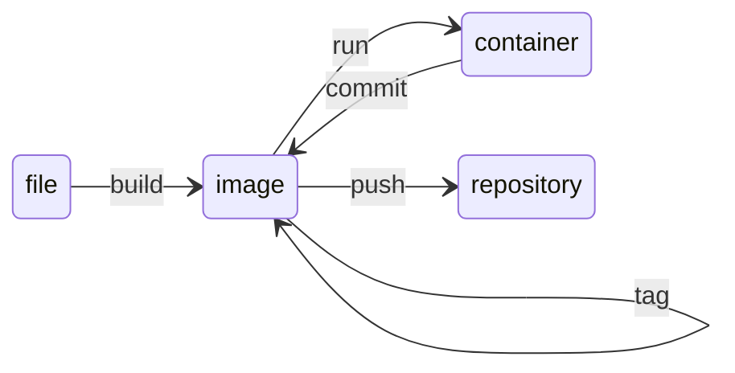

# Setting Environment
## Ubuntu on Windows
### WSL
### Terminal
- MobaXTerm
	- Hopping server
### VS Code with WSL

----
# Docker

## Running Container
### command

### skaffold

## Network

## Volume

## Creating Images

----
# Kubernetes
## Running Pods
### Manifest file

### Helm

## Deployment Strategies

